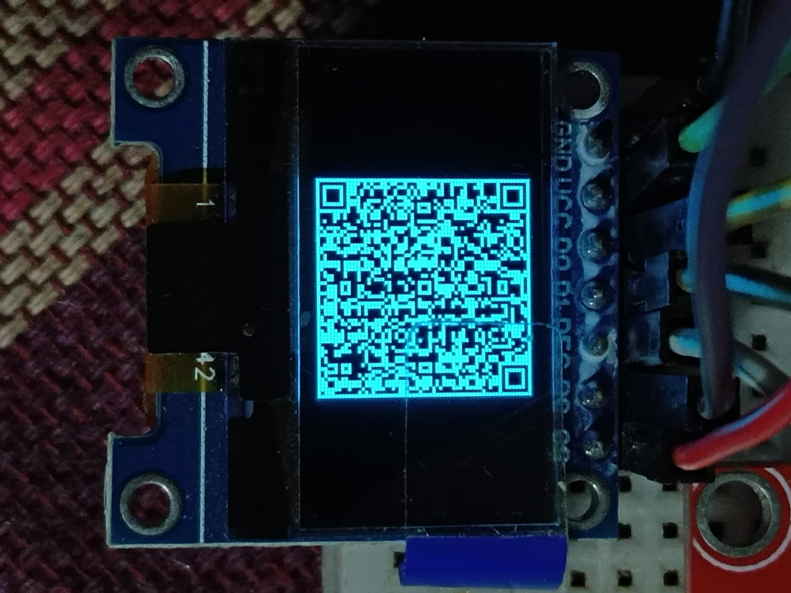

# Raspberry Pi Sensor & Display Interfacing

This repository contains source code and documentation for interfacing different sensors and displays with Raspberry Pi. The provided examples cover a wide range of applications including temperature sensing, motion detection, OLED display output, and more.

## Table of Contents
- [Prerequisites](#prerequisites)
- [Installation](#installation)
- [Supported Sensors & Displays](#supported-sensors--displays)
- [Code Structure](#code-structure)
- [Usage](#usage)
- [Images](#images)
- [Troubleshooting](#troubleshooting)
- [Contributing](#contributing)
- [License](#license)

## Prerequisites
- Raspberry Pi (any model with GPIO support except Pi 5)
- Raspbian or any Linux-based OS installed
- Python 3.x installed
- Required libraries for specific sensors and displays (see installation steps)

## Installation
1. Clone this repository:
   ```bash
   git clone https://github.com/Araham7/rpi-iot-python.git
   cd rpi-iot-python
   ```
<!-- 2. Install required dependencies:
   ```bash
   pip install -r requirements.txt
   ``` -->
3. Enable I2C and SPI (if required):
   ```bash
   sudo raspi-config
   ```
   Navigate to `Interfacing Options` and enable I2C/SPI as per the requirement.

## Supported Sensors & Displays
The following modules are supported:

### Sensors:
- **DHT11/DHT22** - Temperature & Humidity sensor
- **HC-SR04** - Ultrasonic distance sensor
- **NEO-6M GPS module** - GPS positioning and time data

### Displays:
- **SSD1306 OLED** (I2C/SPI)
- **16x2 LCD** (I2C)
<!-- - **TFT Display** (SPI) -->

## Code Structure
```
rpi-iot-python/
├── 01-Interacting-OLED-DISPLAY-using-python
│   ├── 01-oled_hello_world.py
│   ├── 02-digital_clock_oled.py
│   ├── 03-oled_date_time_display.py
│   ├── 04-time_date_system-ip.py
│   ├── 05-oled_system_info_display.py
│   ├── 06-oled_shapes_demo.py
│   ├── 07-Improved-oled_time_date_ip_display.py
│   ├── 08-oled_text_scroller.py
│   ├── Adding-Font
│   │   ├── 01-oled_custom_font_display.py
│   │   ├── 02-oled_custom_font_large_text.py
│   │   ├── Moon_Dance
│   │   │   ├── MoonDance-Regular.ttf
│   │   │   └── OFL.txt
│   │   └── README.md
│   ├── readme.md
│   └── Text-to-QRcode-OLED-Display
│       ├── 01-oled_text_to_qrcode_display.py
│       ├── 02-improved_oled_text_to_qrcode_display.py
│       └── README.md
├── 02-LiquidCrystal_I2C_Display
│   ├── 01-i2c_lcd_display.py
│   ├── 02-i2c_lcd_backlight_control.py
│   ├── 03-i2c_lcd_with_backlight_control.py
│   ├── 04_i2c_DoubLine-Text-Scrolling.py
│   ├── 05-i2c_lcd_simultaneous_scrolling_messages_bothLine.py
│   ├── 06-i2c_lcd_dynamic_scrolling_messages_bothLine.py
│   ├── 07-i2c_lcd_single_line_scrolling.py
│   └── README.md
├── README.md
└── RPi-Sensor-Interfacing
    ├── DHT11_temperature_humidity_sensor
    │   ├── 01-dht11_temperature_humidity.py
    │   └── README.md
    ├── HC-SR04_Ultrasonic_distance_sensor
    │   ├── 01-HC-SR04_ultrasonic_distance_sensor.py
    │   └── README.md
    └── NEO-6M-GPS
        ├── 01-gps_JSON_data_logger.py
        ├── 02-pynmea2_based_gps_JSON_data.py
        ├── 03-minimal_gps_parser.py
        └── readme.md
```

## Usage
Run individual scripts as per your requirement. For example:

1. Read temperature from DHT11 sensor:
   ```bash
   python3 ./03-RPi-Sensor-Interfacing/DHT11_temperature_humidity_sensor/01-dht11_temperature_humidity.py
   ```
2. Display text on OLED screen:
   ```bash
   python3 ./01-Interacting-OLED-DISPLAY-using-python/01-oled_hello_world.py
   ```

## Images
Below is an example of a QR code generated and displayed on the OLED screen:



## Troubleshooting
- Ensure the necessary I2C/SPI interfaces are enabled on Raspberry Pi.
- Check wiring connections and GPIO pin assignments.
- Install missing dependencies.

## Contributing
Feel free to contribute by submitting pull requests, reporting issues, or suggesting improvements.

## License  
This project is licensed under the [MIT License](LICENSE).


